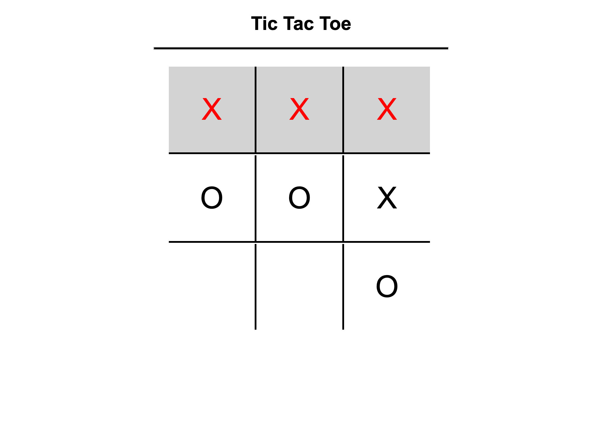

# 🕹️ Tic-Tac-Toe Game

This is a simple **Tic-Tac-Toe** game built using **HTML, CSS, and JavaScript**. It allows players to compete against an **AI opponent**, which makes random moves after the player plays.

## 🚀 Features

✅ **Play Against AI** – The computer automatically makes a move after the player.  
✅ **Smart AI Moves** – The AI prioritizes winning moves, blocks the player’s winning moves, and picks a random empty spot if no better option exists. 
✅ **Dynamic UI Updates** – The board updates in real time with player and AI moves.  
✅ **Winner Detection** – The game highlights the winning tiles.  
✅ **Restart Option (Coming Soon)** – A button to restart the game.

## 🎮 How to Play

1. Open the `index.html` file in a browser.
2. Click on an empty tile to make your move.
3. The AI will automatically respond with its move.
4. The game announces the winner or a tie.
5. Refresh the page to play again.

## 🛠️ Technologies Used

- **HTML** – Structure of the game.
- **CSS** – Styling and animations.
- **JavaScript** – Game logic and AI functionality.

## 🔧 Installation & Setup

1. Clone the repository:
   ```bash
   git clone https://github.com/Luk30lende/Tic-Tac-Toe.git
   ```
2. Navigate to the project folder:
   ```bash
   cd Tic-Tac-Toe
   ```
3. Open `index.html` in your browser.

## 🤖 Future Improvements

- Smarter AI (Minimax algorithm).
- Difficulty levels (Easy, Medium, Hard).
- Reset button to restart the game.
- Improved UI/UX.

 ## 📷 Screenshots




## 📜 License

This project is open-source and available under the **MIT License**.

## Author

**Your Name**  
[Luke Olende](https://github.com/Luk30lende)
